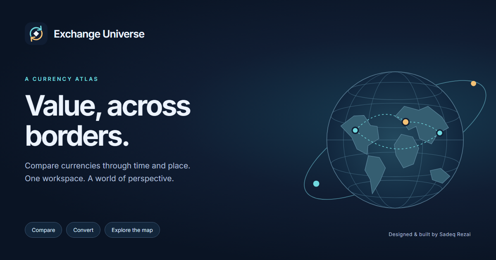

# Exchange Universe

A currency atlas by [Sadeq Rezai](https://rammeshgar.github.io/), built with R Shiny, Leaflet, ECharts and Plotly.

[Open the live dashboard](https://sadeq.shinyapps.io/exchange_universe/) · [Source repository](https://github.com/Rammeshgar/Exchange_Universe_shiny)

## Explore currencies through time and place

- Compare up to six currencies against a supported base, with quote cards, daily-history charts and period-strength statistics.
- Click countries on the Leaflet world map to select/deselect currencies. Shared-currency countries are mapped together; unsupported instruments are not given invented locations.
- Convert amounts, reverse the currency pair and compare converted amounts across your selection.
- Inspect comparison statistics, daily history or current quotes; export CSV and chart images.
- Switch between 2D and optional 3D charts, expand plots/maps, save comparisons locally and share comparison links.
- Responsive settings, light/dark themes, keyboard controls and exact-value tables complement the visual charts.



## Run locally

Use R 4.3.2 to reproduce the supplied dependency lock. From the repository root, in an R console:

```r
install.packages("renv")
renv::restore()
shiny::runApp(".", port = 4888, launch.browser = TRUE)
```

Restoring packages can require platform-specific system libraries, especially for `sf`. Alternatively install the packages listed at the top of `app.R` in your normal R environment. Windows users can run `./Run-Local.ps1` after installing dependencies.

Copy `.env.example` to a private `.env` beside `app.R` and supply your own APILayer Exchange Rates Data API key. Alternatively set `APILAYER_API_KEY` in the server environment. `EXCHANGE_ENV_FILE` can identify a private configuration file. Environment values take precedence. Never commit credentials or place them in `www/`.

## Data and calculation conventions

APILayer supplies rates and supported symbols; coverage and freshness depend on your subscription. A recorded October 2026 check returned 174 symbols, including some non-geographic instruments. This is not a permanent coverage guarantee.

Let `q(t)` be units of the selected currency per one unit of the base:

- Converted amount: `amount × q(t)`.
- Selected-currency strength: `(q(start) / q(t) - 1) × 100`.

Positive strength means the selected currency strengthened against the base. Change % and Index 100 are equivalent up to an offset; the redundant index control was removed. Historical observations are daily, not intraday. Missing observations remain missing; display rounding does not change underlying calculations.

Cards and conversion use the latest verified quote. Historical views use the selected period/date. Low/high statistics cover the aligned period, not only the selected day. `Start-date rate` is the first aligned observation, not a market-open price. The map shows current currency geography, not historical borders.

Rates are indicative, before fees and buy/sell spreads, and are not financial advice or executable offers. Review the provider's terms before redistributing data.

## Quotas, storage and reliability

Shared caching, bounded request queues, deduplication, retry backoff and a five-minute latest-attempt window reduce unnecessary calls. Free-plan allowance can be small; one visitor action does not necessarily equal one API request. Refresh cadence is constrained by configuration and detected allowance. A faster poll cannot make the provider's data fresher.

Local caches persist locally. Shinyapps.io disk is ephemeral and not shared between instances; continuous hourly archives require a separate scheduled collector and durable storage. In-process bounds are not distributed quota enforcement.

The deployed app has been manually reviewed, and the owner reported the map working after the deferred-widget experiment was reverted. Performance is still unfinished: a recorded mobile Lighthouse run scored 39 and timed out. Accessibility scored 100 in that run, but this is not a complete accessibility certification. Hosting crawl restrictions, library deprecations and client-blocked analytics affect other audit scores. No promise of perfect performance, security or search visibility is made.

## Analytics and privacy

On public hosts, GA4 and Microsoft Clarity tags load automatically unless the visitor previously disabled them. Without an explicit saved allowance, storage-consent signals remain denied. Privacy settings allow disabling or granting consent. Local previews do not load the providers. Advertising consent remains denied.

GA4 uses path-only page locations and allowlisted view events. Comparison settings and converter areas have Clarity masking attributes. Masking and consent signals are not guarantees that all collection is prevented or that legal obligations are satisfied. Review account settings and disclosures for your deployment. Fork owners should replace or remove the original analytics project IDs.

## Repository structure

| Path | Purpose |
| --- | --- |
| `app.R` | Shiny entry point and shared state |
| `R/` | Configuration, provider, cache, calculations, plots and UI |
| `www/` | Styles, scripts, brand assets and self-hosted fonts |
| `data/` | Country metadata, prepared geometry and attribution |
| `scripts/` | Local startup, collection, preparation and focused checks |
| `renv.lock` | Dependency versions |

See [deployment notes](DEPLOYMENT.md), [security notes](SECURITY.md), [changes](CHANGELOG.md), and [data attribution](data/SOURCES.md).

Some development browser scripts reference the original review machine's Node/Playwright paths. They are not portable application dependencies. Earlier review scripts may describe superseded analytics behavior; the current automatic-tag checks are in `scripts/analytics-auto-review.cjs`.

Third-party data/fonts retain their included notices. The optional music asset requires distribution permission; remove or replace it if you do not have those rights. This update does not assign a new license to the existing repository's source code.
